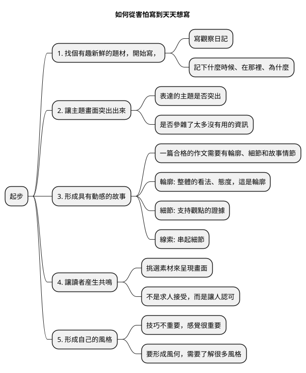

# 吳軍 閱讀與寫作課50講

Noted 2020/06/01

  寫作的目的，是理解他人，是表達自我。

## 閱讀的方法

### 品位 - 建構自已的知識體系

- 品位不夠，了解的知識點再多，終成不了大學問家。
- 基準線思維
- 從閱讀"正統"文獻或者作品開始。找到在領域或行業裡主流認可的基準線知識。
- 第一步就是讀教科書；第二步讀權威的綜述文章，基本上會把一個領域最近年的成就概括了。第三步是讀一些有趣的專著。

### 速度

- 要做到有意識地閱讀，提高對文章結構和有用資訊的敏感度。
- 評價閱讀效果，即包括主題思想、作者的態度、也包括特定內容的具體信息。
- 文本結構、書本的目錄結構、微觀細節的6w1h的問題。
- 提高閱讀速度的關鍵，是不斷練習眼睛和腦子的同步。
- 閱讀並不需要理解每一個詞。遇到不認識的詞，不要停，跳過去。

### 層次

- 閱讀要分層，來兼顧廣度和深度。
- 第一類，瀏覽的書，快速翻翻。4h翻完一本書，跳著讀，一開始讀著仔細，中間有些章節就跳過去了，或者每一章頭尾讀得仔細，中間快速瀏覽一下。讀一遍能了解書的輪廓和感興趣的內容。
- 第二類，細讀的書，逐句讀完。
- 第三類，典藏的書，長期放在書架上。做為參考書和品讀的書。
- 最深層的閱讀是樹根，深度閱讀的目的是在把一本書讀透之後，用它的內容構建知識體系和認知的框架。另一個目的是為了去偽存真。

### 欣賞 - 如何體會經典文學的魅力

- 讀文學，首先是去體會語言的美感。一種成熟的語言，它不僅能承載信息，還有它的美感，把握作者真實的含義。

    那是最美好的时代，那是最糟糕的时代；
    It was the best of times, it was the worst of times,
    那是智慧的年头，那是愚昧的年头；
    it was the age of wisdom, it was the age of foolishness,
    那是信仰的时期，那是怀疑的时期；
    it was the epoch of belief, it was the epoch of incredulity，
    那是光明的季节，那是黑暗的季节；
    it was the season of Light, it was the season of Darkness，
    那是希望的春天，那是失望的冬天；
    it was the spring of hope, it was the winter of despair
    我们拥有一切，我们一无所有；
    we had everything before us, we had nothing before us,
    我们全都在直奔天堂，我们全都在直奔相反的方向
    we were all going direct to Heaven, we were all going direct the other way
    一一简而言之， – in short,
    那时跟现在非常相像，某些最喧嚣的权威坚持要用形容词的最高级来形容它。
    the period was so far like the present period, that some of its noisiest authorities insisted on its being received,
    说它好，是最高级的；说它不好，也是最高级的。
    for good or for evil, in the superlative degree of comparison only

## 寫作的方法

### 起步 - 如何從害怕寫到天天想寫

